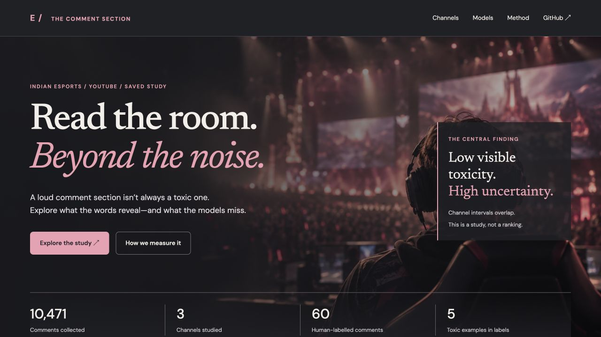

# Toxicity in Indian Esports YouTube Comments

How toxic are the comment sections of India's biggest gaming channels, and how well can automatic tools tell? This project collects recent comments from three of the biggest channels (Total Gaming, Techno Gamerz and Gyan Gaming), labels a sample by hand, measures three detection methods against those labels, and estimates the share of toxic comments per channel with confidence intervals.

[](https://colab.research.google.com/github/harsh-github007/Identifying-Toxicity-Within-Esports-YouTube-Channels/blob/main/notebooks/run_study.ipynb)

## Interactive research frontend



Explore saved channel estimates with 95% uncertainty intervals, switch between corrected all-comment and human-labelled estimates, compare model metrics, and inspect raw word-list flags by video. The interface reads `results/metrics.json`; it does not collect comments or run inference. Decorative esports artwork depicts a fictional player.

```bash
python -m http.server 4184
# Open http://localhost:4184
```

No JavaScript dependencies or build step are required. The included Pages workflow publishes static assets and aggregate results after changes to main. Set GitHub Pages source to GitHub Actions before deploying.

## Findings (September 2026 run)

10,471 comments from the 10 latest uploads of each channel; 60 hand-labelled, 5 of them toxic. Full tables and charts: [`results/results.md`](results/results.md).

- **Visible toxicity is low.** Correcting the word list for its measured error rates gives 2.1% for Gyan Gaming (95% CI 0.2%–8.2%), 0.6% for Total Gaming (0.0%–2.2%) and 0.0% for Techno Gamerz (0.0%–0.6%).
- **The channels can't be ranked yet.** Gyan Gaming comes out highest, but its intervals overlap the others'. More labels would settle it.
- **The off-the-shelf model failed on Hinglish.** Detoxify multilingual reached an F1 of 2.4%, with 1.3% precision: almost everything it flagged was harmless. The transparent word list did best (F1 44%, specificity 99.8%), and a small model trained on the labels was the most precise (48.5%) but missed most toxic comments.
- **What toxicity there is, is mostly mild.** The toxic comments in the sample were insults ("noob" used as an attack, mocking the creator's voice) and casual Hindi abuse; none were threats or hate.

| Channel | Comments | All-comments estimate (95% CI) |
| --- | ---: | ---: |
| Gyan Gaming | 339 | 2.1% (0.2%–8.2%) |
| Total Gaming | 5,056 | 0.6% (0.0%–2.2%) |
| Techno Gamerz | 5,076 | 0.0% (0.0%–0.6%) |


## Why it's hard

Most comments are **Hinglish**: Hindi written in Latin script, mixed with English, with creative spelling ("bhaii", "opp", "ch*tiya"). Off-the-shelf toxicity models are trained mostly on English and European languages, and English sentiment tools read Hinglish as neutral. Any claim about toxicity here is only as good as the check against human judgement, so that check is built into the design.

## Method

1. **Collect** (`toxicity collect`). The YouTube Data API v3 fetches comments and replies from each channel's 10 most recent uploads. Author IDs are hashed, so no usernames are stored. Collection stops if two channels share videos or more than 15% of their comments, so the same comments can't end up filed under two channels.
2. **Score** (`toxicity score`). Every comment gets two automatic judgements:
   - [Detoxify](https://github.com/unitaryai/detoxify)'s multilingual XLM-RoBERTa model, a toxicity probability from 0 to 1.
   - A transparent Hinglish and English [word list](config/lexicon.csv) with whole-word matching that sees through leetspeak, stretched letters and masked spellings.
3. **Sample** (`toxicity sample`). 400 comments are drawn for hand labelling, stratified by channel and over-sampling comments either method flagged, because toxic comments are rare. Each sampled comment carries a weight so all later estimates remain unbiased. The labelling sheet hides the channel and the automatic scores.
4. **Label** by hand, following the [labelling guide](docs/labelling-guide.md).
5. **Evaluate** (`toxicity evaluate`). Three methods are compared against the labels with 5-fold cross-validation, weighted precision, recall and F1, and bootstrap confidence intervals:
   - the word list,
   - Detoxify with its threshold tuned inside each fold,
   - a character n-gram logistic regression trained on the labels, which suits Hinglish spelling variation.
6. **Estimate** toxicity per channel two ways:
   - **Hand-labelled estimate:** the weighted share of labelled comments that are toxic, with a stratified Jeffreys interval that stays honest when toxic comments are rare.
   - **All-comments estimate:** the best method applied to every comment, corrected for its measured sensitivity and specificity with the Rogan–Gladen estimator. A bootstrap resamples both the labels and whole videos, since comments on one video aren't independent.

## Running it

**In Colab (recommended):** click the badge above. It needs a free YouTube Data API key: in [Google Cloud Console](https://console.cloud.google.com/), create a project, enable *YouTube Data API v3*, then go to *Credentials → Create credentials → API key*. The default settings use a few hundred of the 10,000 free daily quota units.

**Locally** (Python 3.10+):

```bash
pip install -e ".[model,dev]"
export YOUTUBE_API_KEY=...        # never commit this
python -m toxicity collect
python -m toxicity score
python -m toxicity sample -n 400  # then label data/annotation/to_label.csv, save as labels.csv
python -m toxicity evaluate       # writes results/results.md and charts
pytest                            # 19 tests, no network needed
```

Channels and collection limits are set in [`config/channels.yaml`](config/channels.yaml).

## Project layout

```
config/channels.yaml        channels and collection limits
config/lexicon.csv          word list, with categories and notes on excluded terms
src/toxicity/collect.py     YouTube API client, pagination, overlap guard
src/toxicity/text.py        cleaning and normalisation for Hinglish
src/toxicity/lexicon.py     word-list matching
src/toxicity/score.py       Detoxify scoring
src/toxicity/sample.py      stratified, weighted labelling sample
src/toxicity/evaluate.py    cross-validated metrics, prevalence estimates, intervals
src/toxicity/report.py      charts and results.md
notebooks/run_study.ipynb   the whole study in Colab
docs/labelling-guide.md     labelling rules
tests/                      pytest suite with a mocked YouTube API
```

## Limitations

- Small labelled sample: 60 of the 400 drawn comments, with only 5 toxic, so every interval is wide. Labelling the remaining rows and re-running `evaluate` would tighten them.
- Two planned channels (A_S Gaming, Desi Gamers) returned no comments through the API and were dropped.
- One annotator. A second annotator labelling a subset would allow inter-annotator agreement to be reported.
- Recent uploads only; a single controversial video or live stream can move a channel's rate.
- Comments already removed by YouTube or the channel's moderators are invisible to the API, so these figures describe what remains visible.

## Acknowledgements

Started as a project at SRM Institute of Science and Technology under the guidance of Dr. Subalalitha C N.

## References

1. Obadimu, A., Mead, E., Hussain, M. N., & Agarwal, N. (2019). Identifying toxicity within YouTube video comments. *SBP-BRiMS 2019*.
2. Guberman, J., Schmitz, C., & Hemphill, L. (2016). Quantifying toxicity and verbal violence on Twitter. *CSCW '16 Companion*.
3. Hanu, L., & Unitary team (2020). Detoxify. GitHub, https://github.com/unitaryai/detoxify.
4. Rogan, W. J., & Gladen, B. (1978). Estimating prevalence from the results of a screening test. *American Journal of Epidemiology*, 107(1), 71–76.

## License

MIT © Harsh Raj
