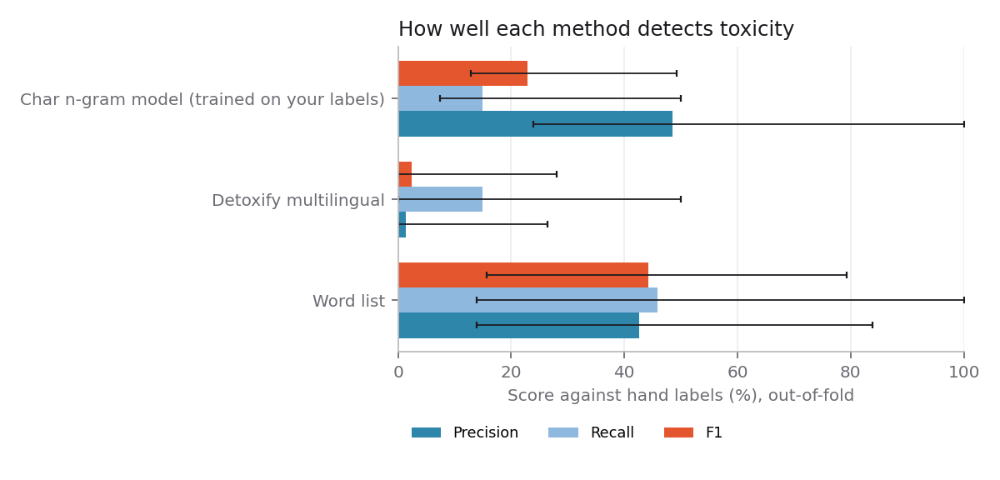
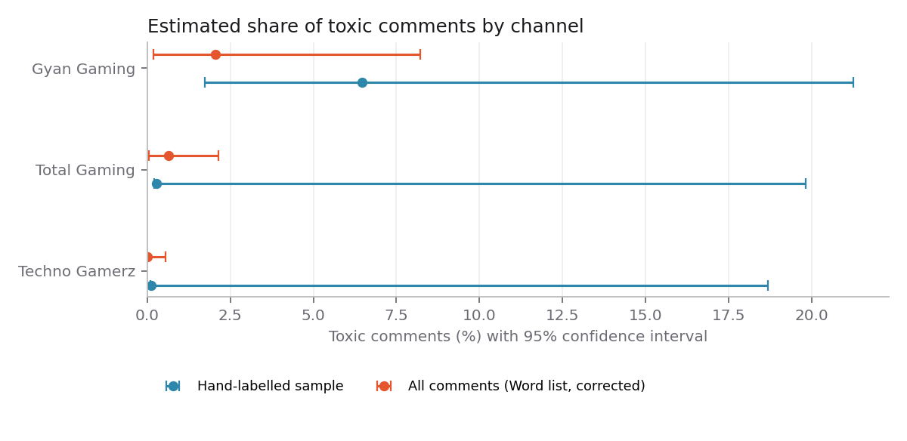

# Results

10,471 comments collected; 60 labelled by hand, of which 5 were toxic.
86.9% of comments are written in Latin script (English or romanised Hindi).

## Detection accuracy

Scored against the hand labels with 5-fold cross-validation, weighted to reflect how the sample was drawn.

| Method | Precision | Recall | Specificity | F1 (95% CI) |
| --- | ---: | ---: | ---: | ---: |
| Word list | 42.6% | 45.9% | 99.8% | 44.2% (15.6%–79.3%) |
| Detoxify multilingual | 1.3% | 15.0% | 95.5% | 2.4% (0.0%–28.0%) |
| Char n-gram model (trained on your labels) | 48.5% | 15.0% | 99.9% | 22.9% (12.9%–49.3%) |

Best method: **Word list**.

## Toxicity by channel

| Channel | Hand-labelled estimate | All-comments estimate | Comments | Videos |
| --- | ---: | ---: | ---: | ---: |
| Gyan Gaming | 6.5% (1.7%–21.3%) | 2.1% (0.2%–8.2%) | 339 | 10 |
| Total Gaming | 0.3% (0.2%–19.8%) | 0.6% (0.0%–2.2%) | 5,056 | 10 |
| Techno Gamerz | 0.1% (0.1%–18.7%) | 0.0% (0.0%–0.6%) | 5,076 | 10 |

## Other findings

- Flagged rate in replies: 0.0%; in top-level comments: 0.4%.
- Median likes on flagged comments: 0.0; on the rest: 0.0.

## Caveats

- Labels come from one annotator following `docs/labelling-guide.md`. A second annotator on a subset would let us report inter-annotator agreement.
- Every channel's confidence interval overlaps the others, so none can be called more toxic than another at this sample size.
- Recent uploads only: rates can shift with a controversial video or a live-stream spike.
- The best method still misses most toxic comments (recall 45.9%), so the all-comments estimates lean heavily on the error correction.
